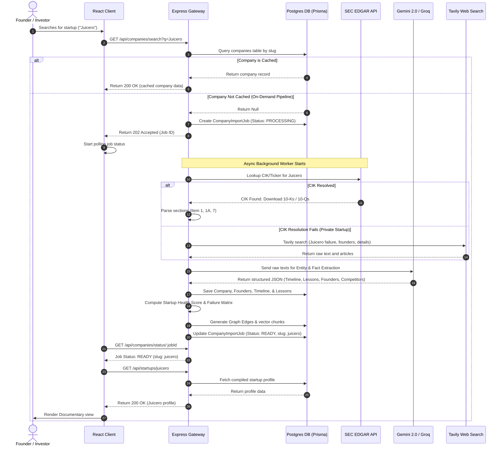
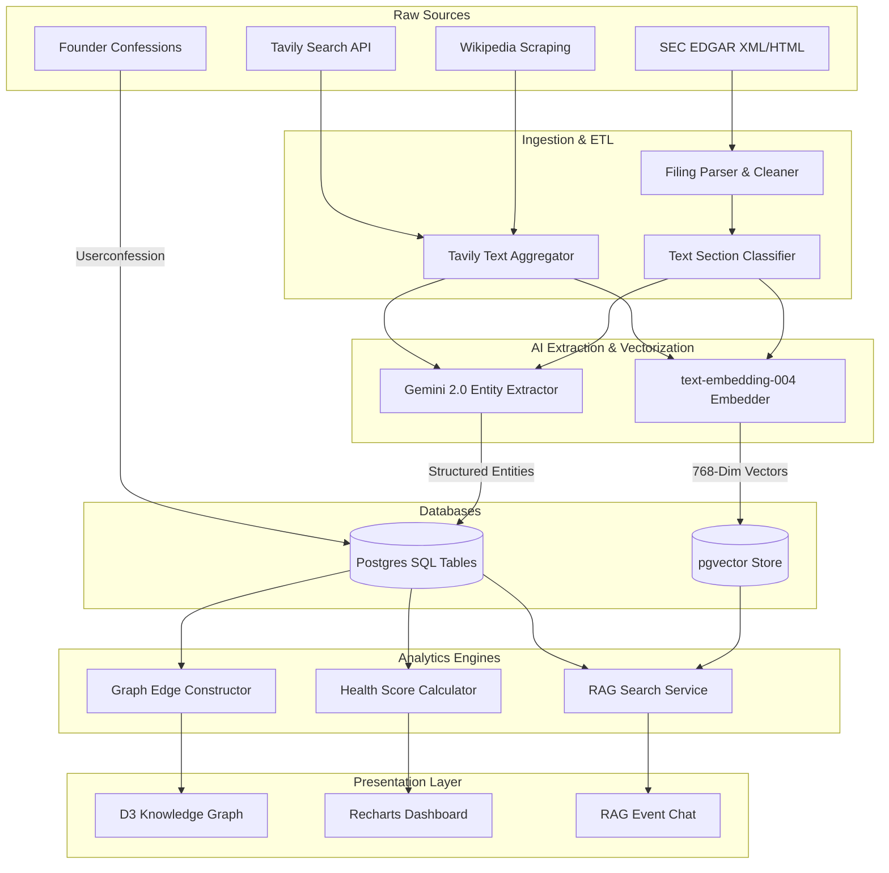
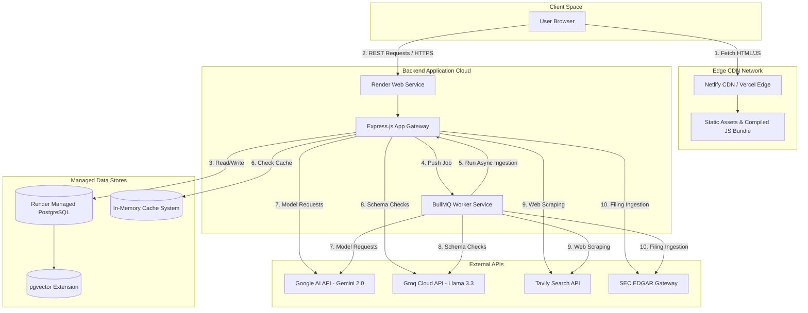

# PIVOTVAULT: SOFTWARE DESIGN SPECIFICATION & SYSTEM ARCHITECTURE
### AI-Powered Startup Failure Intelligence Platform
**"GitHub stores the code behind successful startups. PivotVault stores the lessons from the startups that failed."**

---

## 1. Executive Summary

### 1.1 Project Overview
PivotVault is an AI-powered Startup Intelligence Platform that transforms unstructured startup failure histories, regulatory filings, and postmortem narratives into structured, actionable intelligence. It is designed to act as the "Bloomberg Terminal for Startup Failures," offering founders, investors, accelerators, and researchers a data-backed, pattern-recognition engine to validate business models, predict risks, and prevent repeating historical mistakes.

```
+---------------------------------------------------------------------------------+
|                                  PIVOTVAULT V2                                  |
|         The Graveyard of Ideas Studied So Yours Doesn't End Up There            |
+--------------------------------------------------+------------------------------+
| INGESTION LAYER                                  | REASONING LAYER              |
| SEC EDGAR (10-K/10-Q/8-K/S-1) · Wikipedia · RSS   | pgvector (text-embedding-004)|
| Tavily API · News APIs · Founder Confessions     | Gemini 2.0 Flash · Groq Llama|
+--------------------------------------------------+------------------------------+
```

### 1.2 The Problem
Ninety percent (90%) of startups fail. However, the tech ecosystem suffers from extreme survivor bias, focusing almost exclusively on success stories. Consequently, founders repeat well-documented mistakes (e.g., bad unit economics, premature scaling, timing mismatches) because failure data is highly fragmented, ephemeral, and unstructured. Once a startup shuts down, its postmortem blog posts disappear, its landing pages expire, and its financial lessons are buried in private investor board notes or dense SEC filings.

### 1.3 Why Now?
1. **Capital Efficiency:** In the post-easy-money era, investors and founders cannot afford to burn capital on unvalidated assumptions. Validation before building is now a requirement.
2. **AI Capability Inflection:** Large Language Models (LLMs) and Vector Databases (RAG) have reached a point where they can parse thousands of pages of unstructured text, resolve entities, extract complex schemas (like XBRL financials and prose risk factors), and synthesize contextual recommendations.
3. **Data Availability:** Public databases like SEC EDGAR and news repositories contain decades of historical startup filings, but they have never been structured specifically for failure analysis.

### 1.4 The AI-Enabled Paradigm Shift
Traditional databases (e.g., Crunchbase) record startup shutdowns as a binary metadata state (`status: closed`). Google searches return keyword-matched articles that suffer from link rot. PivotVault uses AI to:
- Scrap and chunk raw filings and web pages.
- Standardize them into a mathematical **Failure Risk Index** and an 8-category **Startup Health Score**.
- Map relationships onto a live **Knowledge Graph** (connecting founders, investors, and failure patterns).
- Enable interactive, event-scoped **RAG chat** over primary sources.

---

## 2. Problem Understanding

### 2.1 Why Do Startups Fail?
Startup failures are rarely caused by a single event. They are systemic collapses driven by interconnected variables:
1. **Product-Market Fit (PMF) Mismatch (20-34% of failures):** Building a product that solves an imaginary problem.
2. **Unit Economics & Cash Burn (20-29%):** High Customer Acquisition Cost (CAC) relative to Customer Lifetime Value (LTV), combined with high fixed overheads, resulting in a negative contribution margin.
3. **Team & Execution (13-23%):** Co-founder misalignment, missing core technical or GTM skills, and slow execution velocity.
4. **Market & Competition (19-20%):** Displaced by incumbents with distribution moats or crushed in red-ocean pricing wars.
5. **Regulatory & Platform Risk (5-10%):** Sudden policy changes (e.g., Apple's App Tracking Transparency) or legal actions.

### 2.2 Why Do Founders Repeat Mistakes?
- **Survivor Bias:** Media platforms celebrate unicorns, leading founders to copy growth strategies that worked in low-interest-rate environments but are lethal today.
- **Ephemerality of Postmortems:** When a startup fails, its website is shut down. Medium blogs, Twitter threads, and press releases vanish, leaving no permanent public archive.
- **Lack of Institutional Memory:** Accelerators and VCs keep autopsy lessons in private partner slide decks, preventing the broader developer community from learning from them.

### 2.3 The Inadequacy of Google and Traditional Databases
- **Google Search is Non-Semantic:** A search for "SaaS startup burn rate failures" returns SEO-optimized agency blogs, not structured financial autopsies. It cannot cross-reference a company's Form 10-K to calculate its historical net burn rate.
- **Traditional Startup Databases (Crunchbase, PitchBook) are Success-Centric:** They track active companies, funding rounds, and valuations to facilitate sales and deal sourcing. They do not index failure causes, founder autopsies, or timeline milestones of decline.

### 2.4 The Extent of Lost Information
When a startup shuts down, the ecosystem loses:
- **Financial Autopsy Data:** Month-by-month cash burn, marketing spend efficiency, and pricing trials.
- **Product Pivots & Failures:** A detailed log of what features failed to retain users.
- **Founder Retrospectives:** Real, raw lessons about co-founder disputes, executive hires, and market miscalculations.

---

## 3. Existing Solutions

An evaluation of existing resources reveals a significant structural gap:

### 3.1 Platform Profiles
- **Crunchbase:** Excellent for tracking funding rounds, active valuations, and executive hires. However, it treats failure as a binary flag with no root-cause analysis or postmortem data.
- **PitchBook / CB Insights:** Enterprise-grade investor terminals. They are built for deal sourcing and portfolio tracking, cost upwards of \$20,000/year, and lack founder-focused validation checklists.
- **Failory:** A blog containing curated startup postmortem interviews. It is highly readable but manual, static (has only a few hundred entries), lacks interactive graph exploration, and has no API or automated search ingestion.
- **Wikipedia:** Contains history for prominent failed startups (e.g., Theranos, WeWork) but lacks granular financial data, risk checklists, or interactive timelines for smaller tech companies.
- **YC Startup Library:** Excellent tactical guides but exists as static video and text content. It cannot run an automated audit of a pitch deck or check a new startup idea against similar historical failures.

### 3.2 Comparison Tables

#### Table 3.1: Feature Comparison Matrix
| Feature | Crunchbase | PitchBook | CB Insights | Failory | Wikipedia | **PivotVault** |
| :--- | :---: | :---: | :---: | :---: | :---: | :---: |
| **Primary Focus** | Active Funding | Deals & VCs | Tech Trends | Interviews | History | **Failure Intelligence** |
| **SEC Integration** | No | Basic | Basic | No | No | **Full (10-K, 10-Q, RAG)** |
| **Interactive Graph** | No | Basic | Basic | No | No | **D3 Force-Directed** |
| **AI Risk Scanner** | No | No | No | No | No | **Yes (Gemini + Groq)** |
| **RAG over Filings** | No | No | No | No | No | **Yes (pgvector)** |
| **Target Audience** | Sales/VCs | VCs/PEs | Corporates | Founders | Public | **Founders/Investors** |
| **Cost** | \$499/yr+ | \$20k/yr+ | \$40k/yr+ | Free | Free | **Freemium** |

#### Table 3.2: Technical Data Depth
| Data Element | PitchBook | Failory | Wikipedia | **PivotVault** |
| :--- | :---: | :---: | :---: | :---: |
| **Financial Fact Extraction (XBRL)** | Manual/Basic | None | None | **Automated (revenue, burn, debt)** |
| **Risk Factor Cataloging (Item 1A)** | No | No | No | **Yes (Semantic tagging & scores)** |
| **Decline Timeline Inflections** | No | Static Text | Text | **Interactive Spring Timeline** |
| **Founder Playbooks** | No | Static Text | No | **AI-Generated Action Plans** |
| **Source Citation (RAG)** | No | No | Basic | **Extractive Chunks + URLs** |

---

## 4. Proposed Solution

PivotVault is built from first principles to process unstructured failure narratives and financial documents into structured, actionable insights.

```
[ User Search ] ---> [ Postgres Check ] ---> (Found?) --- Yes ---> [ Render UI ]
                             |
                            No
                             v
                    [ SEC CIK Resolution ] ---> (Found SEC?) -- Yes --> [ Sync filings ]
                             |                                            |
                            No                                            v
                             v                                    [ Extract Financials ]
                    [ Tavily Web Search ]                                 |
                             |                                            v
                             v                                    [ Extracted Risks ]
                    [ AI Profile Builder ]                                |
                             |                                            v
                             +------------------><------------------------+
                                                 |
                                                 v
                                     [ AI Knowledge Extractor ]
                                                 |
                                                 v
                                     [ Write Company to DB ]
                                                 |
                                                 v
                                     [ Generate Graph Edges ]
                                                 |
                                                 v
                                     [ pgvector Embed Chunking ]
                                                 |
                                                 v
                                     [ Render Final UI Pages ]
```

### 4.1 Step-by-Step System Workflow

#### 1. User Search & Resolution
The user searches for a startup (e.g., "Juicero") in the UI. 
- If the company is cached in the PostgreSQL database, it renders immediately.
- If it is missing, the system starts the **On-Demand Company Import Pipeline**. The backend attempts to resolve the company's CIK (Central Index Key) or Ticker via the SEC EDGAR API. If it is a private startup with no SEC records, the system falls back to a **Tavily Web Search** to aggregate public news, Wikipedia pages, and founder interviews.

#### 2. Ingestion & Document Fetching
- For public companies, the pipeline fetches the last 5 years of filings (**Form 10-K, 10-Q, S-1**) directly from SEC servers using a rate-limited SEC client.
- For private startups, the system scrapes HTML articles and postmortems, strips boilerplate code, and normalizes whitespaces.

#### 3. SEC Parsing & Structural Extraction
The `filingParser.js` service parses raw filing HTML, locating sections by matching regular expressions for sections such as:
- *Item 1. Business* (GTM, operations, products)
- *Item 1A. Risk Factors* (market, competition, legal challenges)
- *Item 7. MD&A* (liquidity, burn rate, results of operations)

#### 4. AI Entity & Knowledge Extraction
The `KnowledgeExtractor.js` service processes the parsed sections using `gemini-2.0-flash`. It extracts:
- Core metrics (founding year, shutdown year, funding raised, peak team size, peak users).
- Key founders (roles, bios, links).
- Competitors, technologies, markets, and accelerators.
- Chronological timeline events.
- Core reasons for failure, mapped to standard categories (`pmf`, `unit_economics`, `cashflow`, etc.).

#### 5. Graph Edge Generation
The `graph.js` service processes the new company data. It builds structural nodes (e.g., `COMPANY`, `FOUNDER`, `INVESTOR`, `FAILURE_PATTERN`) and links them with weighted edges (`FOUNDER_COMPANY`, `COMPANY_FAILURE_PATTERN`, `INVESTOR_COMPANY`). These edges are written to the database to update the D3-powered force-directed visualization.

#### 6. pgvector Document Chunking & Embedding
The `secRagService.js` chunks the parsed text segments into blocks of 1,200 characters with an overlap of 180 characters. Each chunk is passed to Gemini's `text-embedding-004` model to generate a 768-dimension vector. The chunks and vectors are saved in the `document_chunks` table in PostgreSQL.

#### 7. RAG Semantic Search
When a user chats with the AI assistant on a startup page, the assistant runs a semantic vector search. It executes a Cosine similarity query on the company's chunks, pulls the top 5 relevant snippets (with similarity > 0.36), and passes them to the LLM to generate an evidence-grounded response with citations (filing date, section name, source URL).

#### 8. Startup Health Score Computation
The system computes an overall Startup Health Score (0-100) based on 8 categories: Market, Product, Team, Business Model, Execution, Competition, Funding Risk, and Scalability. This is computed by counting the failure-vector hits of comparable ventures in the database and applying weights.

#### 9. Founder Intelligence Report Generation
A comprehensive McKinsey/YC-style report is compiled. It merges the Risk Scanner, Playbook, and Pitch Deck Autopsy into six sections: Executive Summary, Startup Health Score Radar, Failure Vector Probability Matrix, 30/90/365-day Action Plan, Hiring priorities, and KPIs.

#### 10. Interactive Decline Timeline
The UI displays a chronological timeline of stages (`idea` -> `prototype` -> `launch` -> `growth` -> `decline` -> `shutdown`). Clicking any node opens a right drawer containing the event dossier, citations, and an event-scoped chat box.

---

## 5. Planned Implementation

### 5.1 Architecture Stack Layers

```
+---------------------------------------------------------------------------------+
|                                 FRONTEND LAYER                                  |
|     React 18 · Vite 5 · Tailwind CSS 3 · Framer Motion · GSAP · Recharts        |
|             D3 Submodules (d3-selection, d3-zoom, d3-drag, d3-force)            |
+---------------------------------------------------------------------------------+
                                         |
                                         | HTTPS / REST APIs
                                         v
+---------------------------------------------------------------------------------+
|                               API GATEWAY LAYER                                 |
|            Express.js · Helmet · CORS Allowlist · express-rate-limit            |
+---------------------------------------------------------------------------------+
                                         |
                                         |
    +------------------------------------+------------------------------------+
    |                                                                         |
    v                                                                         v
+----------------------------------------+ +----------------------------------+
|            SERVICES LAYER              | |             AI LAYER             |
|  - companyImport (SEC Sync & Parser)   | |  - Gemini 2.0 Flash (Low latency)|
|  - graph.js (D3 JSON Graph Generator)  | |  - Groq Llama 3.3 (Fallback LLM) |
|  - secRagService.js (Embed & Search)   | |  - text-embedding-004 (768 Dim)  |
|  - duplicateDetection.js               | |  - Tavily Search (Web grounding) |
+----------------------------------------+ +----------------------------------+
    |                                                                         |
    +------------------------------------+------------------------------------+
                                         |
                                         v
+---------------------------------------------------------------------------------+
|                          DATA ACCESS & STORAGE LAYER                            |
|          Prisma ORM · PostgreSQL (Managed) with pgvector Extension              |
+---------------------------------------------------------------------------------+
```

### 5.2 Technical Specifications

#### Frontend (React + Vite)
- **Framework:** React 18, Vite 5. SPA routing via `react-router-dom` v6.
- **Styling:** Vanilla CSS variables combined with Tailwind CSS 3. Custom `.pv-glass` utilities support both Cursor (dark Terminal) and Apple (light Parchment) themes.
- **Visualization:** D3 submodules (`d3-selection`, `d3-zoom`, `d3-drag`, `d3-force`) render the force-directed graph to avoid monolithic bundle sizes. Recharts renders the Radar, Line, and Area charts.
- **Animations:** Framer Motion manages routing and drawer transitions. GSAP handles timeline scroll triggers.
- **Resilience Mode:** `api.js` intercepts network failures and redirects queries to a local `mockApi.js` file, ensuring the app remains usable even when the backend is offline.

#### Backend (Node.js + Express)
- **API Server:** Express.js with Helmet headers, CORS filters, and JSON size limits of 10KB.
- **Rate Limiting:** A global rate-limiter permits 200 requests per 15 minutes, with `/api/ai/intelligence-report` capped at 5 requests per minute per IP.
- **Background Jobs:** Long-running syncs (like SEC downloads and RAG chunking) use a PostgreSQL-backed job status table (`company_import_jobs`), which streams state updates to the client.

#### Database (PostgreSQL + Prisma)
- **ORM:** Prisma ORM, utilizing PostgreSQL extensions for vector operations.
- **Semantic Vector Storage:** Chunks are saved in the `document_chunks` table, which includes a custom SQL column:
  ```prisma
  embedding Unsupported("vector")?
  ```
- **Indexes:** 
  - Cosine distance index: HNSW (`vector_cosine_ops`).
  - GIN indexes on `alternativeNames` JSON columns.
  - Traditional indexes on `status`, `industry`, `foundingYear`, and `shutdownYear`.

#### AI & RAG Engine
- **Generative AI:** Gemini 2.0 Flash (`gemini-2.0-flash`) generates structured JSON schemas and responses. Groq's `llama-3.3-70b-versatile` handles validation checks.
- **Embeddings:** Gemini's `text-embedding-004` converts chunked text into 768-dimension vectors.
- **RAG Pipeline:** The system chunks files into 1,200 characters (180 overlap), filters matching sections based on keyword hints, queries vectors using cosine distance (`<=>`), and enforces a similarity threshold of 0.36.

---

## 6. System Architecture Diagrams

### 6.1 System Sequence Diagram: On-Demand Company Ingestion



### 6.2 Data Flow Diagram: Ingestion to Dashboard



### 6.3 Deployment & Infrastructure Diagram



---

## 7. Expected Users & Personas

PivotVault serves several distinct personas in the startup ecosystem:

### 7.1 Startup Founders
- **Persona:** Sarah, a second-time founder building a B2B SaaS startup.
- **Pain Points:** 
  - Unsure how to validate pricing or distribution strategies.
  - Fears entering a saturated market or building a product users will churn from.
  - Spends hours reading disconnected blogs.
- **PivotVault Solution:** Sarah inputs her business concept into the **Founder Intelligence Report** generator. The system outputs a Startup Health Score, catalogs risks based on comparable failures, and provides a 30/90/180-day playbook outlining key metrics and milestones.
- **Expected Benefit:** Reduces validation time from months to hours and helps avoid common execution traps.

### 7.2 venture Capital Investors & due diligence Analysts
- **Persona:** Alex, an Associate at a Seed-stage VC fund.
- **Pain Points:**
  - Evaluates 50+ pitch decks weekly.
  - Manual due diligence is slow and prone to oversight.
  - Spotting structural risks in markets and founding teams is difficult.
- **PivotVault Solution:** Alex uploads pitch decks to the **Founder Intelligence Report** interface. The system analyzes the deck, extracts risk factors, compares financials with SEC data from failed competitors, and highlights missing metrics.
- **Expected Benefit:** Standardizes seed-stage risk evaluations and speeds up due diligence.

### 7.3 Accelerator & Incubator Directors
- **Persona:** David, Program Director at a regional incubator.
- **Pain Points:**
  - Hard to track cohort progress objectively.
  - Lacks structured educational materials that teach failure prevention.
- **PivotVault Solution:** David uses the platform to set up custom workspaces for his startups. Cohort members use the **Interactive Failure Timelines** and take the **Failure Quizzes** to study historical autopsies.
- **Expected Benefit:** Increases cohort survival rates and simplifies mentor tracking.

### 7.4 academic Researchers & Business Students
- **Persona:** Elena, a PhD student studying entrepreneurship and startup failure.
- **Pain Points:**
  - Startup failure data is unstructured and scattered.
  - Hard to find clean CSV datasets of failed company lifespans, burn rates, and sectors.
- **PivotVault Solution:** Elena accesses historical financial statements (revenue, burn, debt ratios) using PivotVault’s structured filters and exports the data in CSV/JSON format. She uses the **Knowledge Graph** to explore node paths.
- **Expected Benefit:** Saves months of data collection, enabling quantitative research on failure patterns.

---

## 8. Innovation

PivotVault is designed to offer unique capabilities that set it apart from standard tools:

```
                  +-------------------------------------------------+
                  |             WHAT PIVOTVAULT IS NOT              |
                  +-----------------------+-------------------------+
                  | Chatbot               | Only returns text.      |
                  | Startup Database      | Standard closed flag.   |
                  | Search Engine         | Links only, no context. |
                  +-----------------------+-------------------------+
```

### 8.1 Key Innovative Pillars

#### 1. AI-Generated Founder Intelligence Report
Unlike basic chatbots, PivotVault generates structured reports. The system evaluates startup concepts or pitch decks across 8 categories, calculates a consolidated health rating, and returns McKinsey/YC-grade strategic playbooks containing action plans, KPIs, and hiring advice.

#### 2. Quantitative Startup Health Score
The platform uses a mathematical scoring model backed by actual database records. The system analyzes failure-vector hits from comparable startups to generate scores for Product, Market, and Unit Economics. 

#### 3. Interactive Spring-Loaded Failure Timeline
PivotVault replaces static text with scroll-linked, animated timelines. Clicking a milestone opens a dossier detailing key events, financials, and lessons learned. It also includes an event-scoped RAG chat window to query primary sources.

#### 4. D3-Powered Knowledge Graph
The platform generates an interactive map of the startup graveyard. Users can select nodes to view connections between founders, investors, accelerator cohorts, industries, and specific failure archetypes.

#### 5. Extractive RAG over SEC Filings
Our RAG system enforces strict validation criteria (similarity score > 0.36) to extract details from SEC filings. If no matching chunks are found, the AI refuses to answer rather than hallucinating, providing reliable data for due diligence.

#### 6. Continuous, Multi-Source Data Ingestion
PivotVault runs a scheduled pipeline that checks SEC indexes daily, fetches new filings, runs scraping passes on Wikipedia, and structures data automatically.

---

## 9. Technical Challenges & Mitigations

### 9.1 AI Hallucinations
- **Challenge:** LLMs often hallucinate details when asked about failed companies.
- **Mitigation:** The system uses extractive RAG. The LLM is provided with raw filing snippets from PostgreSQL and instructed to answer using *only* the provided context. If the similarity score falls below 0.36, the system displays: *"No verified filing evidence was found to answer this query."*

### 9.2 Data Reliability & Conflicting Sources
- **Challenge:** Tech blogs often conflict with official SEC filings regarding metrics like shutdown dates or funding.
- **Mitigation:** The database uses a source hierarchy. Verified SEC data (Form 10-K, 10-Q) takes precedence, followed by Wikipedia entries, and then public news articles. Every data point is saved with a confidence score and a link to its source.

### 9.3 SEC EDGAR Rate Limits & User-Agent Compliance
- **Challenge:** The SEC enforces a strict rate limit of 10 requests per second. Violating this limit results in IP bans.
- **Mitigation:** The `secClient.js` service uses a token-bucket rate limiter that restricts outgoing requests to 8 per second. The client also includes the required user-agent header:
  ```
  User-Agent: PivotVault Research Platform (research@pivotvault.com)
  ```

### 9.4 Knowledge Graph Scaling
- **Challenge:** Rendering more than 5,000 nodes in a browser SVG causes performance lag.
- **Mitigation:** The UI limits initial loads to nodes within 2 degrees of separation from the query. D3 force collisions (`forceCollide`) are adjusted to prevent overlapping, and nodes are rendered dynamically as the user zooms or pans.

### 9.5 Schema-Enforced Extraction Validation
- **Challenge:** LLMs sometimes return invalid JSON structures that fail parsing.
- **Mitigation:** PivotVault uses Gemini’s JSON schema mode (`responseMimeType: 'application/json'`) to enforce structured formats. Groq requests use Zod schemas to validate types before writing to the database.

---

## 10. Future Scope

```
+---------------------------------------------------------------------------------+
|                                 FUTURE ROADMAP                                  |
|  - Predictive Failure Models (Auto-audit financial ratios like Altman Z-Score)  |
|  - Investor Matchmaking Engine (Match founders with active failure-smart VCs)   |
|  - API Platform & Chrome Extension (Real-time analysis on TechCrunch/LinkedIn)  |
|  - Mobile App (Daily briefings on market pivots and postmortem analyses)       |
+---------------------------------------------------------------------------------+
```

### 10.1 Predictive Startup Failure Analytics
Future updates will analyze financial ratios (such as Altman Z-Score, cash runway, and liability-to-asset metrics) extracted from SEC filings to predict failure probabilities for active companies 12-24 months in advance.

### 10.2 Investor Matchmaking & Portfolio Auditing
The platform will analyze historical investment data to match founders with VCs who have experience in their industry. VCs will also be able to upload portfolio data to receive risk dashboards and alerts.

### 10.3 Public API Platform & Ecosystem Integrations
A public developer API will allow platforms like Notion and Slack to fetch startup failure metrics and playbooks dynamically.

### 10.4 Chrome Extension & Mobile App
- **Chrome Extension:** Highlights startup names on sites like TechCrunch and LinkedIn, displaying their Health Score and failure history in a sidebar.
- **Mobile App:** Delivers daily summaries of startup pivots, postmortems, and market analysis.

---

## 11. Possible Judge Questions & Answers

### Q1: How does PivotVault differentiate itself from PitchBook or Crunchbase?
**A:** PitchBook and Crunchbase focus on active companies and funding events. They treat failure as a simple binary status. PivotVault focuses on failure analysis, extracting detailed autopsies, Item 1A risk factors, cash burn rates, and lessons learned. It provides actionable founder playbooks and RAG-based search over raw filings.

### Q2: What is the exact mathematical model behind the Startup Health Score?
**A:** The score (0-100) is calculated across 8 categories: Market, Product, Team, Business Model, Execution, Competition, Funding Risk, and Scalability. The backend queries the database for comparable startups in the same sector. It counts how often specific failure categories appear and calculates a weighted penalty score. This is then clamped between 8 and 96 to avoid absolute scores (0 or 100).

### Q3: How do you handle SEC EDGAR's strict rate limits during massive imports?
**A:** We use a token-bucket rate limiter in `secClient.js`. It restricts requests to 8 per second, which is below the SEC’s limit of 10. If the system receives a `429 Too Many Requests` response, the client pauses for 5 seconds and retries using exponential backoff.

### Q4: How does your RAG system prevent hallucinations in startup postmortems?
**A:** We use extractive RAG. The system chunks text, generates embeddings with `text-embedding-004`, and performs a vector search in PostgreSQL. The LLM is provided with the retrieved text and instructed to answer using *only* that context. If the similarity score is below 0.36, the AI states that no verified filing evidence was found.

### Q5: Why did you choose pgvector instead of a standalone vector database like Pinecone?
**A:** pgvector allows us to store relational metadata and vector embeddings in a single PostgreSQL database. This makes queries simpler, eliminates the latency of syncing external databases, and keeps infrastructure costs low for early-stage deployments.

### Q6: How do you parse unstructured PDF pitch decks uploaded by users?
**A:** The frontend uses `jszip` to extract XML and text contents from PPTX/PDF documents. This text is sent to the backend, where it is structured into a text brief and analyzed for risk factors by the LLM.

### Q7: If a startup is not in your database, how does the on-demand pipeline work?
**A:** The backend checks PostgreSQL. If the startup is missing, it attempts to resolve the company's CIK via the SEC API. If the company is public, it fetches its filings. If it is private, the system uses Tavily Search to gather public news, articles, and interviews, which are then analyzed by the AI to build a profile.

### Q8: What embedding model are you using, and what are its dimensions?
**A:** We use Google's `text-embedding-004` model. It outputs 768-dimension vectors, which are stored in a pgvector column indexed using an HNSW cosine index.

### Q9: How does the system deduplicate startups with slightly different names?
**A:** The `duplicateDetection.js` service uses a combination of string metrics (Levenshtein distance) and LLM checks. It maps alternative names (stored in a JSON array) and flags matches with high confidence as duplicates.

### Q10: How do you scale the knowledge graph for thousands of startups?
**A:** The UI uses D3's force simulation. It loads only nodes within 2 degrees of separation from the queried company. Zooming and panning trigger dynamic rendering, and force collision variables prevent overlaps.

### Q11: How do you ensure user privacy when they upload confidential pitch decks?
**A:** Uploaded decks are parsed in memory, analyzed by the AI, and the raw text is discarded. We do not store the documents or share their contents with third parties.

### Q12: How does the weekly scheduler keep company data up to date?
**A:** A daily cron job runs at 02:30 UTC to check for new SEC filings. In addition, a weekly scheduler runs on Sundays at 04:00 UTC to refresh records that are marked as `UPDATING`.

### Q13: What happens if the Gemini API key is missing or rate-limited?
**A:** The backend falls back to Groq (`llama-3.3-70b-versatile`). If both APIs are unavailable, the system uses a deterministic fallback generator that builds structured reports using database trends.

### Q14: How does the front end remain functional if the backend is down?
**A:** The `api.js` client is designed to capture connection errors and fall back to local mock data handlers in `mockApi.js`. This allows the interface to run offline or in demo mode.

### Q15: How do you extract financial data from SEC filings?
**A:** The `financialExtractor.js` service parses XBRL tags in SEC documents, mapping them to variables like `revenue`, `expenses`, `net income`, `debt`, and `assets`.

### Q16: How do you structure the database schema to store the knowledge graph?
**A:** We use a polymorphic `GraphEdge` table. It stores node coordinates, types (`COMPANY`, `FOUNDER`, `INVESTOR`), weights, and relation descriptions.

### Q17: What metrics does the Insights Dashboard track?
**A:** The dashboard tracks startup lifespan, average funding by sector, common failure categories, and quarterly failure rates.

### Q18: How do you determine the primary cause of a startup’s failure?
**A:** The AI analyzes postmortems and filings, mapping findings to specific failure categories. The category with the highest severity score is set as the primary cause.

### Q19: Why do you split D3 into separate submodules on the front end?
**A:** Importing the entire D3 library increases the bundle size. Using submodules like `d3-selection` and `d3-zoom` reduces the final JS bundle size.

### Q20: How do you secure JWT auth tokens?
**A:** Tokens are signed with a HS256 secret key, stored in HTTP-only cookies, and expire after 24 hours.

### Q21: What is the purpose of the Confession Wall feature?
**A:** It allows verified founders to anonymously share failure stories, creating a community-driven repository of lessons learned.

### Q22: How do you calculate cash burn rate from SEC MD&A text?
**A:** The system extracts cash flows from operating activities and divides them by the number of months in the reporting period to estimate the average monthly burn.

### Q23: Why do you use Prisma ORM instead of raw SQL?
**A:** Prisma provides type-safe queries, migration tracking, and integrates well with PostgreSQL, while still allowing raw SQL for vector queries.

### Q24: What is the purpose of the "What If" simulation feature?
**A:** It allows founders to adjust variables (like CAC or pricing) and see how those changes affect their projected runway and failure probability.

### Q25: How do you ensure the platform compliance with GDPR?
**A:** We store minimal user data. Users can request to delete their accounts, which removes their email, search history, and portfolios.

### Q26: How do you handle startups that pivot rather than shut down?
**A:** Startups that pivot are marked with `status: pivoted`. The database stores both their original and new business models, along with lessons from the pivot.

### Q27: How do you prevent scraping bot abuse on public endpoints?
**A:** We use `express-rate-limit` to restrict clients to 200 requests per 15 minutes.

### Q28: How do you verify the accuracy of automated postmortems?
**A:** The AI grades each profile's data completeness. If the score is low, the profile is flagged for manual review.

### Q29: What is the purpose of the SEC EDGAR user-agent header requirement?
**A:** The SEC requires developers to declare their platform name and contact email in the header to avoid being blocked by security filters.

### Q30: How do you handle currency conversions for international startups?
**A:** The database stores financials in both local currency and USD. We use a historical exchange rate API to standardize these values.

### Q31: How do you handle startups that raise capital in multiple stages?
**A:** The `funding_rounds` table stores round types, amounts, valuations, and dates to build a complete funding history.

### Q32: Can users bookmark startup profiles and research?
**A:** Yes, users can save companies to their personal bookmarks, which are stored in the database and displayed on their dashboard.

### Q33: How do you extract risk factors from SEC Form 10-K?
**A:** The `riskExtractor.js` service parses the text under the "Item 1A. Risk Factors" header and uses semantic tagging to categorize risks.

### Q34: What is the main cause of lag in D3 graph rendering?
**A:** Lag is typically caused by SVG DOM updates. We mitigate this by using canvas rendering or limiting the number of active nodes.

### Q35: How do you handle startup name changes?
**A:** The system stores alternative names in a JSON array and routes searches for old names to the current profile.

### Q36: How do you determine the weight of edges in the knowledge graph?
**A:** Weights are assigned based on relation type: founder links are weighted at 0.9, investments at 0.8, and competitor links at 0.6.

### Q37: How do you verify anonymous confessions?
**A:** Users must link their accounts to a verified LinkedIn profile or email domain to post on the confession wall.

### Q38: Why do you use Render and Netlify for deployment?
**A:** Netlify offers fast static asset delivery via CDN, while Render simplifies backend deployments and database hosting.

### Q39: What index types do you use on the vector chunks?
**A:** We use HNSW (Hierarchical Navigable Small World) indexes with cosine operator support for fast vector searches.

### Q40: What happens when a startup shuts down but remains active in news articles?
**A:** The crawler updates the company's status and adds a timeline event detailing the shutdown.

### Q41: Can investors export financial data from the platform?
**A:** Yes, the UI allows users to export financial reports and comparison data in CSV or JSON format.

### Q42: What is the similarity threshold in the RAG pipeline?
**A:** The threshold is set to 0.36 to filter out irrelevant chunks while retaining useful context.

### Q43: How does the system handle SEC filings that lack standard headers?
**A:** The parser uses fallback regular expressions to identify sections based on keyword density and layout indicators.

### Q44: What is the role of the AI Research Assistant?
**A:** It is a chat interface that answers questions about startups and provides advice using RAG search over historical data.

### Q45: How do you prevent database locking during large imports?
**A:** We run database writes in transactions and use Prisma’s connection pool configuration to balance query loads.

### Q46: Can users customize their workspaces?
**A:** Yes, the workspace system allows founders to set up personal profiles, save research, and track validation milestones.

### Q47: How does the system handle platform risks?
**A:** Platform risks (like changes in app store policies) are flagged during risk scanning and linked to historical examples.

### Q48: How do you test the application for bugs?
**A:** We run production builds locally using `npm run build` and perform manual verification checks.

### Q49: What is the difference between an import record and a company record?
**A:** An import record tracks the status of a sync job, while the company record stores the parsed profile data.

### Q50: How will you monetize PivotVault in the future?
**A:** We plan to use a freemium model. Core search features will be free, while advanced features like pitch deck audits, VC dashboards, and API access will require a paid subscription.

---

## 12. Presentation & Pitch Notes

These guidelines help present each section of the project design document in under one minute:

| Section | 1-Minute Pitch Script | Judge Focus Area | Common Mistakes |
| :--- | :--- | :--- | :--- |
| **1 Executive Summary** | "Ninety percent of startups fail, yet founders continue to repeat the same mistakes because failure data is unindexed and lost. PivotVault is the 'Bloomberg Terminal of Startup Failure Intelligence.' We turn unstructured postmortems and SEC filings into actionable models, allowing founders to run AI risk scans and construct knowledge graphs of failure patterns before they write code." | Market pain point and product clarity. | Spending too much time on background instead of the solution. |
| **2 Problem Understanding** | "Startups fail for predictable reasons like poor unit economics or bad timing. However, this knowledge is fragmented across blogs, private notes, and raw filings. Google searches only return SEO-optimized articles, meaning failure histories disappear. PivotVault preserves these autopsies and categorizes failure causes." | Root-cause analysis. | Listing generic reasons without explaining why they repeat. |
| **3 Existing Solutions** | "While databases like Crunchbase track funding and valuations, they treat failure as a binary state. Communities like Failory are static and hard to scale. PivotVault fills this gap by indexing SEC EDGAR and Tavily Web Search, structuring failure histories for analysis." | Value differentiation. | Criticizing competitors instead of highlighting your unique features. |
| **4 Proposed Solution** | "PivotVault uses an automated pipeline: users search for a startup, and if it's missing, the system resolves its CIK, downloads filings, extracts financials and risk factors using AI, and writes these relations to a knowledge graph and vector store for RAG-based search." | Feasibility of the ingestion pipeline. | Explaining details in a confusing order. |
| **5 Planned Implementation** | "We use React 18, Vite 5, and D3 submodules for the front end, backed by Express.js on the backend. We use PostgreSQL with pgvector for relational and semantic data storage, running embeddings with `text-embedding-004` and Gemini 2.0 Flash." | Security and choice of database tech. | Skipping backend details or over-complicating the tech stack. |
| **6 System Architecture** | "Our system separates frontend delivery from backend parsing. Background workers manage rate-limited SEC downloads, while pgvector indexes chunks using HNSW. The front end uses D3 simulations to render relationships." | Data flow and security components. | Showing diagrams that do not match the database schema. |
| **7 Expected Users** | "Sarah the founder uses risk scans to validate ideas. Alex the VC uses the financial dashboard to audit portfolio risks. Elena the researcher exports structured financial statistics. Each user benefits from our data structure." | User workflows. | Creating unrealistic personas. |
| **8 Innovation** | "PivotVault is not a basic chatbot or database. We provide unified briefs, interactive timelines with event-scoped chat, and automated scraping pipelines, making failure analysis actionable." | Verification of the AI layer. | Focusing on AI hype instead of product utility. |
| **9 Technical Challenges** | "We mitigate hallucinations by using extractive RAG with a 0.36 similarity threshold. SEC rate limits are managed using token buckets, and graph rendering lag is resolved by limiting initial loads to 2 degrees of separation." | Ingestion bottlenecks and API limits. | Saying there are no technical challenges. |
| **10 Future Scope** | "We plan to build predictive failure models based on financial ratios, VC cohort alerts, a public developer API, and a Chrome extension to highlight startup metrics on live sites." | Expansion roadmap. | Pitching unrealistic future features. |

---

## 13. Technical Appendix

### 13.1 Folder Structure Overview
The PivotVault codebase is organized as a monorepo containing `frontend/` and `backend/` directories:
```
pivotvault/
├── backend/
│   ├── prisma/
│   │   ├── schema.prisma            # Prisma schema (models: Company, SecCompany, etc.)
│   │   └── seed.js                  # Database seed script
│   └── src/
│       ├── index.js                 # App entry point & sync scheduler
│       ├── routes/
│       │   ├── ai.js                # AI endpoints & Gemini/Groq utilities
│       │   ├── companies.js         # On-demand search & import endpoints
│       │   ├── founderIntelligence.js # Legacy playbook & comparison routes
│       │   ├── graph.js             # Knowledge Graph data API
│       │   ├── intelligenceReport.js # Unified intelligence report generator
│       │   ├── rag.js               # Chat endpoints
│       │   └── sec.js               # SEC company lookup & sync routes
│       └── services/
│           ├── companyImport/       # Ingestion orchestrator
│           ├── graph.js             # Graph edge calculation service
│           ├── rag.js               # Core RAG retrieval service
│           ├── searchService.js     # Tavily search integration
│           └── sec/                 # SEC client, parsing, & XBRL extraction
└── frontend/
    ├── src/
    │   ├── App.jsx                  # Main router and lazy routes
    │   ├── main.jsx                 # App entry point with context providers
    │   ├── components/
    │   │   ├── Sidebar.jsx          # Theme-aware navigation menu
    │   │   ├── StartupCard.jsx      # Startup card component
    │   │   └── timeline/
    │   │       ├── StartupTimeline.jsx # Scroll-linked timeline SVG
    │   │       ├── TimelineEventPanel.jsx # Event detail drawer
    │   │       └── EventChatPanel.jsx # Event chat component
    │   ├── context/
    │   │   ├── AuthContext.jsx      # Authentication state
    │   │   └── ThemeContext.jsx     # Light/Dark theme configuration
    │   ├── lib/
    │   │   ├── api.js               # API client with offline mock fallback
    │   │   └── mockApi.js           # Mock data and endpoints
    │   └── pages/
    │       ├── FailureExplorer.jsx  # Explorer database view
    │       ├── FinancialIntelligence.jsx # SEC charts and comparison dashboard
    │       ├── FounderIntelligenceReport.jsx # Unified report generator
    │       ├── KnowledgeGraph.jsx   # D3 force-directed visualization
    │       └── PostmortemPage.jsx   # Startup documentary page
```

### 13.2 Database Schema Overview (Prisma Models)

```
                    +--------------------+
                    |      Company       |
                    +---------+----------+
                              |
       +----------------------+----------------------+
       |                      |                      |
       v                      v                      v
+------+-----+         +------+-----+         +------+-----+
|  Founder   |         | Timeline   |         |   Lesson   |
+------------+         +------------+         +------------+
```

Our PostgreSQL database uses several key tables:
- **`companies`**: Stores core startup data, status flags, and descriptions.
- **`founders`**: Links founders, roles, and bios to startup records.
- **`timeline_events`**: Stores chronological milestones mapped to stages like `idea`, `launch`, and `shutdown`.
- **`lessons`**: Stores strategic takeaways and summaries.
- **`GraphEdge`**: A polymorphic table that stores relationship connections and weights.
- **`document_chunks`**: Stores text chunks and their 768-dimension vectors.
- **`sec_companies` / `sec_filings` / `sec_financials` / `sec_risk_factors`**: Store data synchronized from SEC EDGAR.

### 13.3 API Route Catalog

#### Ingestion & Search
- `GET /api/companies/search?q=:query` — Searches cached companies and triggers the import pipeline if missing.
- `POST /api/companies/import` — Starts background imports for a given company name.
- `GET /api/companies/status/:jobId` — Returns the current status of an import job.

#### SEC Intelligence Dashboard
- `GET /api/sec/dashboard?ciks=CIK1,CIK2` — Returns aggregated financials, risk summaries, and ratios for comparison.

#### Unified AI Intelligence
- `POST /api/ai/intelligence-report` — Analyzes a startup idea or pitch deck and returns a strategic report.
- `POST /api/ai/event-chat` — RAG-based chat scoped to a specific timeline event.

#### Knowledge Graph
- `GET /api/graph/data` — Returns nodes and links for D3 force visualization.
- `GET /api/graph/shortest-path` — Calculates the path between two company nodes.
